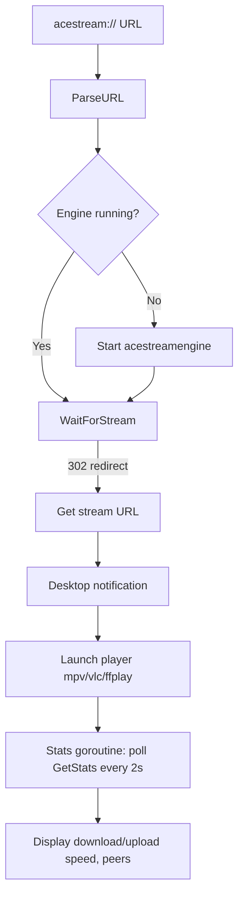

# Architecture

## Overview

Aceplay is a Linux-only Go CLI that reimplements `acestream-launcher`. It parses `acestream://` URLs, auto-starts the `acestream-engine` if not running, waits for the stream to become available, and launches the user's preferred video player (mpv, vlc, or ffplay). Built with the Charm ecosystem for terminal UI.

## Module & Version

- **Module**: `github.com/crstian19/aceplay`
- **Go**: 1.25.8 (go.mod), CI uses 1.26
- **Current release**: v0.4.3

## Code Structure

| Path | Package | Responsibility |
|---|---|---|
| `cmd/main.go` | `main` | CLI entry point, Cobra commands, orchestration |
| `pkg/acestream/url.go` | `acestream` | Public `acestream://` URL parser (40-char hex content ID) |
| `pkg/acestream/client.go` | `acestream` | Public HTTP client for the acestream-engine API (stdlib `net/http`) |
| `pkg/acestream/stats.go` | `acestream` | Stream stats types + JSON/query-string parsing |
| `internal/engine/engine.go` | `engine` | Local acestream-engine process lifecycle (spawn, probe, kill) |
| `internal/config/config.go` | `config` | Viper-based config (YAML + env vars + flags) |
| `internal/player/player.go` | `player` | Video player launcher (mpv/vlc/ffplay) |
| `internal/notify/notify.go` | `notify` | Desktop notifications via `notify-send` |
| `internal/ui/logger.go` | `ui` | Charm Log wrapper (structured logging) |
| `internal/ui/styles.go` | `ui` | Lipgloss styles, stream status rendering |
| `internal/ui/wizard.go` | `ui` | First-run setup wizard + config editor (Huh) |

## Dependencies

| Dependency | Version | Purpose |
|---|---|---|
| `charm.land/huh/v2` | v2.0.3 | Interactive TUI forms/wizards |
| `charm.land/lipgloss/v2` | v2.0.3 | Terminal styling |
| `charm.land/log/v2` | v2.0.0 | Structured logging |
| `github.com/spf13/cobra` | v1.10.2 | CLI framework |
| `github.com/spf13/viper` | v1.21.0 | Configuration management |
| `github.com/stretchr/testify` | v1.11.1 | Testing assertions |

## Data Flow



## Key Components

### URL Parser (`pkg/acestream/url.go`)

Public API for parsing `acestream://<40-char-hex-content-id>` URLs. Uses `net/url.Parse` first, falls back to regex. Normalizes content ID to lowercase. Validates exactly 40 hex characters.

### Engine Client (`pkg/acestream/client.go`)

Public, reusable, and built on stdlib `net/http` — no HTTP wrapper library. It only
speaks to an engine that is already listening, so it also works against a remote one.

- `WaitForStream` requests `/ace/manifest.m3u8` with redirects disabled (`CheckRedirect`
  always returns `http.ErrUseLastResponse`) and returns the `Location` header on 302.
- `GetStats` polls `/ace/getstream?method=get_stats`, tries JSON then query-string fallback.
- `IsRunning` probes 3 endpoints; any HTTP response means "running".
- `WithBaseURL` overrides host/port for tests and reverse-proxied engines.

### Engine Lifecycle (`internal/engine/engine.go`)

Private on purpose: it shells out to a binary and owns an OS process, which is not
reusable. `Manager.Start` probes ports `[6878, 45615, 8080, 9999]` for a running engine
and returns the port it found; otherwise it spawns `acestreamengine --client-console
--http-port 6878` (when auto-start is enabled) and waits until the client answers.
`Manager.Stop` only kills an engine this process started. The port it returns is pushed
into the client with `SetPort`, so an engine already running on a non-default port is
addressed correctly.

### Config (`internal/config/config.go`)

Viper-based. Searches `~/.config/aceplay/config.yaml` (or `$XDG_CONFIG_HOME/aceplay/`). Env prefix `ACEPLAY_`. Defaults: mpv, localhost:6878, 60s timeout, HLS off.

### Player (`internal/player/player.go`)

Finds executable via `exec.LookPath`, falls back to common paths (`/usr/bin`, `/usr/local/bin`, `~/.local/bin`). Player-specific default args:
- mpv: `--force-window=immediate --cache=yes`
- vlc: `--play-and-exit --network-caching=3000`
- ffplay: `-fflags nobuffer -flags low_delay -strict experimental`

`Play()` is non-blocking (`cmd.Start()`), `PlayAndWait()` is blocking (`cmd.Run()`).

## CLI Commands

```
aceplay [acestream-url]          # Play (or first-run wizard if no args)
aceplay play [url]               # Explicit play command
aceplay config                   # Interactive config menu
aceplay config show              # Print current config
aceplay config set [key] [value] # Set a config key
aceplay config edit              # Interactive config editor
aceplay install                  # Register acestream:// protocol handler
aceplay register-protocol        # Same as install
aceplay version                  # Print version info
aceplay interactive              # Interactive config editor
```

## Distribution

- **GoReleaser**: Linux only (amd64 + arm64), `.deb` + `.rpm` packages
- **AUR**: Two packages — `aceplay` (source build) and `aceplay-bin` (pre-built binary)
- **No Docker**: Desktop CLI tool, not containerized
- **Renovate**: Automated dependency updates

## Known Issues

1. **`Play()` is fire-and-forget**: `runPlay` uses `Play()` (non-blocking), so the stats goroutine is cancelled almost immediately. The player process becomes orphaned. `PlayAndWait()` exists but isn't used.
2. **`IsRunning()` logic always true**: The condition `statusCode < 500 || statusCode == 500` is tautological — any HTTP response means "running". This is the intended behavior but the code is misleading.
3. **`AutoStart` config field ignored**: `main.go` always passes `WithAutoStart("acestreamengine")` regardless of config. The `engine.auto_start` YAML key has no effect.
4. **`AutoStartCommand` unused**: Config field exists but `main.go` hardcodes `"acestreamengine"`.
5. **`WaitForStream` doesn't retry**: Despite the name, it makes a single request. If the stream isn't ready, it fails immediately instead of polling.
6. **`runConfigSet` silently ignores invalid durations**: `time.ParseDuration` error is swallowed with `_`.
7. **NoopNotifier.IsAvailable() returns true**: Semantically misleading — the noop notifier claims to be available.
